[TOC]


# Image Processing in Python

Images are everywhere! We live in a time where images contain lots of information, which is sometimes difficult to obtain. This is why image pre-processing has become a highly valuable skill, applicable in many use cases. In this course, you will learn to process, transform, and manipulate images at your will, even when they come in thousands. You will also learn to restore damaged images, perform noise reduction, smart-resize images, count the number of dots on a dice, apply facial detection, and much more, using scikit-image. After completing this course, you will be able to apply your knowledge to different domains such as machine learning and artificial intelligence, machine and robotic vision, space and medical image analysis, retailing, and many more. Take the step and dive into the wonderful world that is computer vision!

## Chapter 1: Introducing Image Processing and scikit learn

Jump into digital image structures and learn to process them! Extract data, transform and analyze images using NumPy and Scikit-image. With just a few lines of code, you will convert RGB images to grayscale, get data from them, obtain histograms containing very useful information, and separate objects from the background!

Image processing is used in various fields. The main purpose of image processing is: 

*   Visualization
    *   To find objects that are not easily visible
*   Image sharpening and Restoration
    *   To create a better image from the original image
*   Image Retrival
    *   Look for image of interest
*   Measurement of Pattern
    *   Measure various objects in the image
*   Image Recognition
    *   Distinguish objects in an image

We will make use of the python library called **scikit-image**. 

### What is an Image? 

An image is a 2D matrix of square pixels. These pixels can be arranged in columns and rows. Here's an example of an image and associated pixels. 

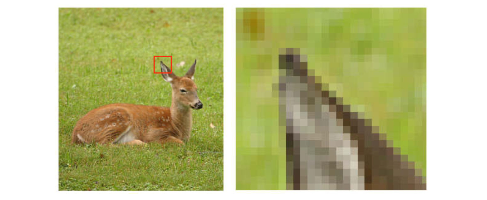

Such a matrix has information about color and intensity. Here's an example of a grayscale image along with the intensity values: 

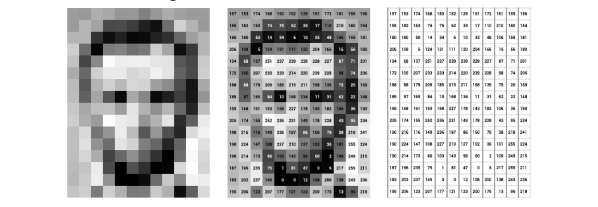

The numbers correspond to the intensity of the colors. 

Color images are often represented in **RGB channels** as can be seen here: 

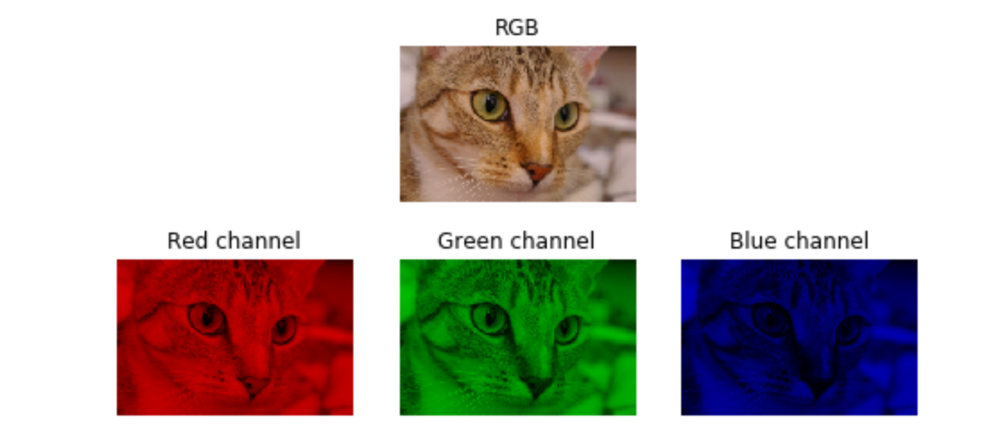

Such an image is represented by a 3D matrix where each channel is a 2 x 2 matrix and in total they represent a 2 x 2 x 3 matrix. 

In scikit-image, we can convert a color image to grayscale using the following way: 

```python
from skimage import color
grayscale = color.rgb2gray(original)

# Turn it back to color: 
rgb = color.gray2rgb(grayscale)
```

In this course, we will use the following function to show image: 

```python
def show_image(image, title='Image', cmap_type='gray'):
    plt.imshow(image, cmap=cmap_type)
    plt.title(title)
    plt.axis('off')
    plt.show()
```

So, here's we can do this: 

```python
show_image(grayscale, 'Grayscale')
```

We can see a little more about color and grayscale image. For example given the following images loaded in Python: 

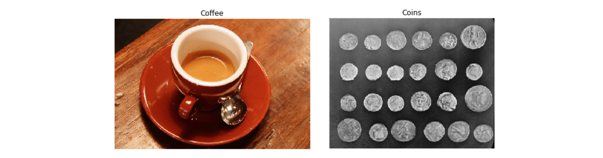

```python
print(type(coffee_image))
print(coffee_image.shape)

numpy.ndarray
(400, 600, 3)
```

So, we see that a color image is a 3D matrix while the grayscale image is a 2D array. 

```python
print(coins_image.shape)

(303, 384)
```

scikit-image have their own default images that we can load and play with: 

```python
# Import the modules from skimage
from skimage import data, color

# Load the rocket image
rocket = data.rocket()

# Convert the image to grayscale
gray_scaled_rocket = color.rgb2gray(rocket)

# Show the original image
show_image(rocket, 'Original RGB image')

# Show the grayscale image
show_image(gray_scaled_rocket, 'Grayscale image')
```

### Numpy for Images

With numpy we can do some fundamental image processing such as: 

*   Flipping images
*   Extract features
*   Analyzing features

Note that a color image is a multi-dimensional numpy array. Given a color image, we can obtain the channels as follows: 

```python
red = image[:, :, 0]
green = image[:, :, 1]
blue = image[:, :, 0]
```

We can plot each channel to show the intensity of each of the channels: 

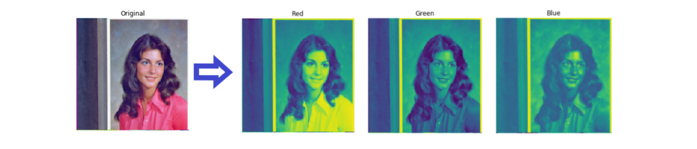

We can turn this image into a grayscale and see the intensities as well: 

```python
plt.imshow(red, cmap='gray')
plt.title('Red')
plt.axis('off')
plt.show()
```

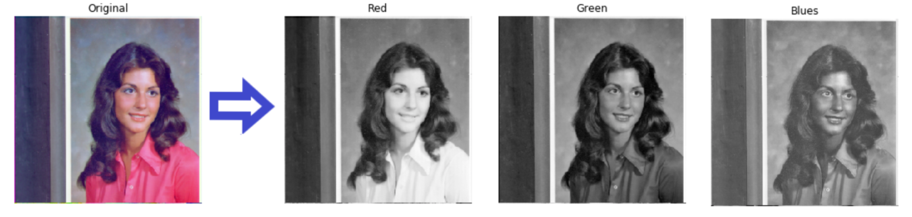

We can flip an image vertically and horizontally in the following way: 

```python
vertically_flipped = np.flipud(image_name)
horizontally_fllipped = np.fliplr(image_image)
```

The histogram of an image shows the number of intensities a value has in an image. 

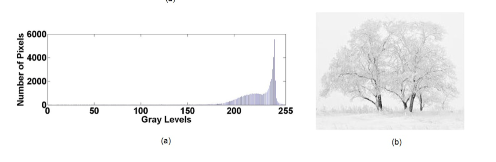

In the above image, we see that the gray Levels go from `0 - Pure Black` to `255 - Pure White`.  We can create a histogram with RGB image. We will have three histograms based on three channels. 

The application of histograms include: 

*   Analysis of various intensities and values
*   Thresholding
*   Brightness and Contrast
*   Equalize an Image

The histogram is created in the following way: 

```python
red = image[:. :, 0]

plt.hist(red.ravel(), bins=256)
```

We set `bins=256` because the image has 256 values. 

### Thresholding

Thresholding is used to partition an image into a foreground and background. We do this by setting each pixel at a certain threshold value. For example, we can threshold based on black intensities and white intensities for a given grayscale image. 

Thresholding is the simplest method used for image segmentation. It is used to isolate objects for: 

*   Object detection
*   Face detection 
*   Etc...

Thresholding works best in high contract grayscale images. Therefore, color images are often converted to grayscale and then thresholded: 

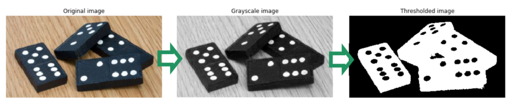

We start by setting the threshold to the middle of the range, that is at 127, which is between 0 and 255. Then we do thresholding: 

```python
thres = 127
binary = image > thres
```

We can also do inverted thresholding: 

```python
thres = 127
inverted_binary = image <= thres
```

In scikit-image, we have two categories to thresholding: 

*   Global or histogram-based: This is good for uniform backgrounds
*   Local or Adaptive: this is good for uneven background illumination

Here's an example of both of these techniques: 

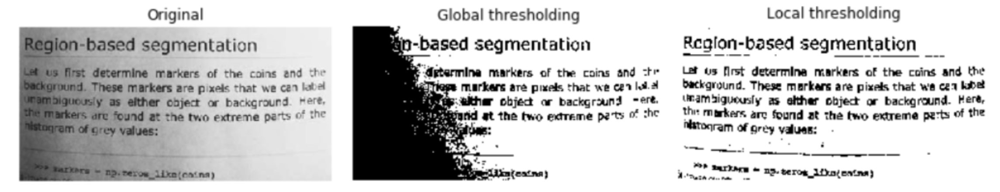

We see that local does a better job than global on this uneven background illumination. 

scikit-image includes a function called `try_all_threshold` so that you can evaluate which threshold works best for you. 

```python
from skimage.filters import try_all_threshold

fig, ax = try_all_threshold(image, verbose=False)

show_all(fig, ax)
```

Doing so, we can see all thresholding: 

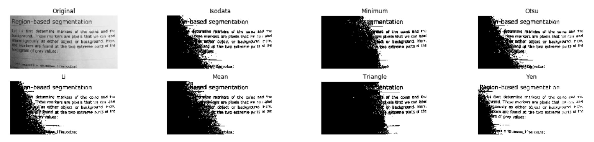

#### Thresholding on Uniform Backgrounds

If the image has uniform background, we can find an optimal threshold rather than setting an arbitrary one. This is done by using the optimal threshold value function from `skimage.filters`. 

```python
from skimage.filters import threshold_otsu

thresh = threshold_otsu(image)
binary_global = thresh < image
```

#### Thresholding on Uneven Backgrounds

If the image does not have uniform background, we make use of `threshold_local`. We use this function to calculate the threshold in a small pixel region surrounding each pixel we are binarizing. To do that we set a block size to surround each pixel. This is known as local neighborhood. The offset is used to subtract from the mean of local threshold value: 

```python
from skimage.filters import threshold_local
block_size=35
local_thresh = threshold_local(text_image, block_size, offset=10)
binary_image = image > local_thresh
```

>   Block size must be an odd number. 

If the image already has a contrast, use global filter thresholding else use the local. Here in this image we see that the image has high contrast. Using global and local produces drastic differences: 

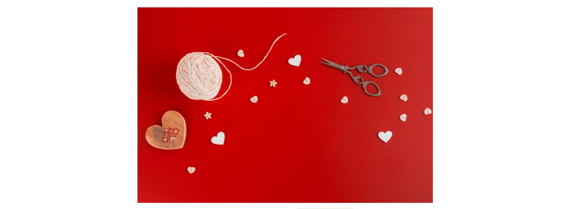

Local thresholding: 

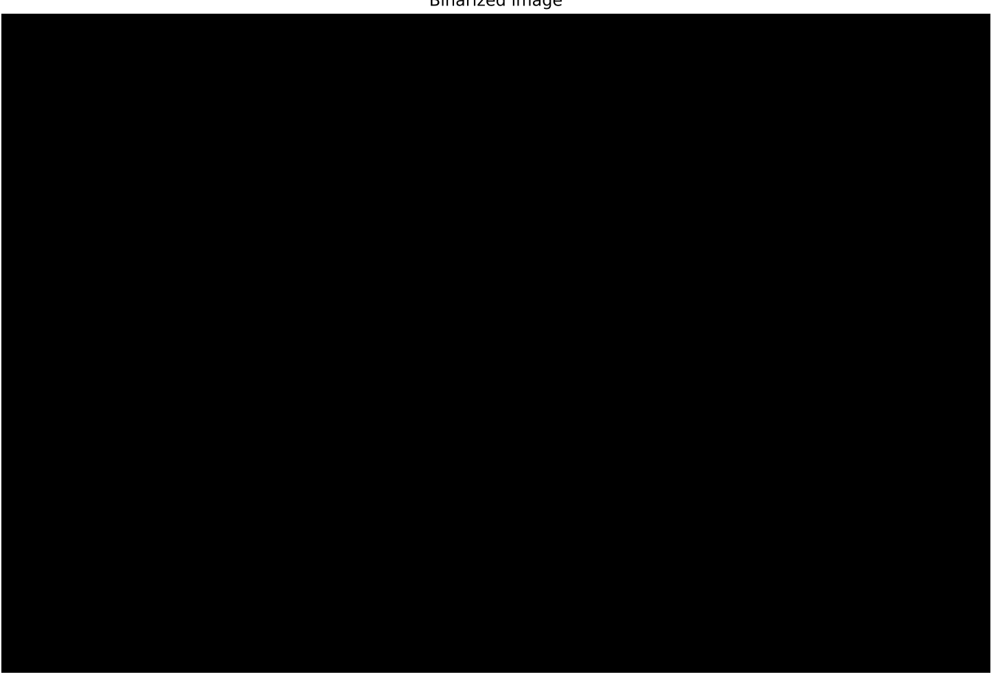

Global filtering: 

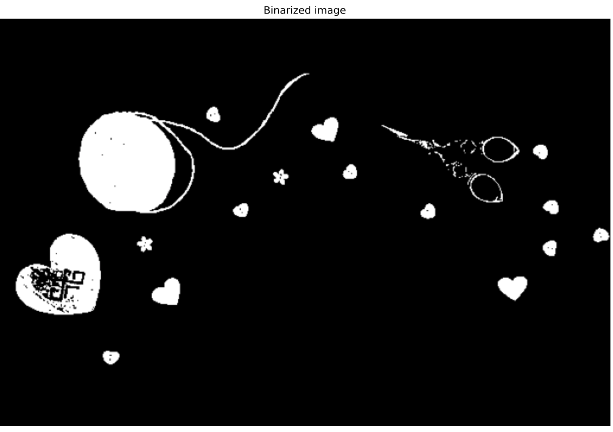

## Chapter 2: Filters, Contrast, Transformation, and Morphology

You will learn to **detect object shapes** using edge detection filters, **improve medical images** with contrast enhancement **and even enlarge pictures to five times its original size!** You will also apply morphology to make thresholding more accurate when segmenting images and go to the next level of processing images with Python.

### Filtering

Filtering is a technique that is used to enhance an image. In addition, filtering is used for: 

*   Emphasizing or removing features
*   Smoothing
*   Sharpening
*   Edge Detection

Certain image processing operations involve processing an image in sections, called blocks or neighborhoods, rather than processing the entire image at once. This is the case for filtering, histogram equalization for contrast enhancement, and morphological functions, all three of which use this approach.

Fiiltering can also be used for edge detection. Edge detection is finding boudaries of objects within an image. Edge detection works by detecting discontinuities in brightness. This is seen in the image here: 

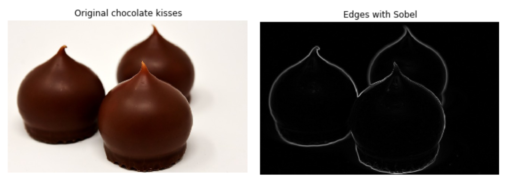

#### Sobel 

The most common method for edge detection is **sobel**. 

```python
from skimage.filters import sobel
edge_sobel = sobel(image_chocolate)
plot_comparison(image_chocolate, edge_sobel, 'Edge with Sobel')
```

>   Sobel requires a 2D grayscale image as input

The `plot_comparison` function is defined as follows: 

```python
def plot_comparison(original, filtered, title_filtered):
    fig, (ax1, ax2) = plt.subplots(ncols=2, figsize=(8,6),
                                   sharex=True, sharey=True)
    ax1.imshow(original, cmap=plt.cm.gray)
    ax1.set_title('original')
    ax1.axis('off')
    ax2.imshow(filtered, cmap=plt.cm.gray)
    ax2.set_title(title_filtered)
    ax2.axis('off')
```

#### Gaussian Smoothing

The Gaussian smoothing technique is used to blur an image or to reduce noise. This filter blurs edges and reduces contrast. 

```python
from skimage.filters import gaussian

# Apply edge detection filter
gaussian_image = gaussian(amsterdam_pic, mutlchannel=True)

plot_comparison(amsterdam_pic, gaussian_image, 'Blurred with Gaussian')
```

>   The `multichannel` is set to `True` if the image is color, else it needs to be set to `False`

### Contrast Enhancement

Contrast enhancement is generally used for images that have low contrast. For example, medical images such as this has low contrast: 

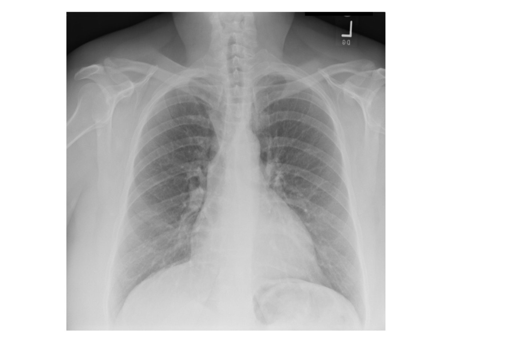

Increasing the contrast helps to identify critical information in an image. Contrast can be seen as a measure of an image's dynamic range or the spread in an histogram. A high contrast image has a broader histogram while a low contrast has a narrow histogram. 

Contrast enhancement increases or widens the histogram so that the entire range is filled. This is known as **contrast stretching**. Another technique used to increase contrast is called **histogram equalization**. Here the most frequent values are spread using probability distribution. 

#### Histogram Equalization

There are three types of histogram equalizations: 

1.  Standard Histogram Equalization - Uses global histogram values
2.  Adaptive Histogram Equalization
3.  Contrast Limited Adaptive Histogram Equalization (CLAHE) - Uses histogram values based on a local region rather than a global histogram values

Here's how it is done for histogram equalization:  

```python
# Import the required module
from skimage import exposure

# Use histogram equalization to improve the contrast
image_eq =  exposure.equalize_hist(image_aerial)

# Show the original and resulting image
show_image(image_aerial, 'Original')
show_image(image_eq, 'Resulting image')
```

We can see the results here: 

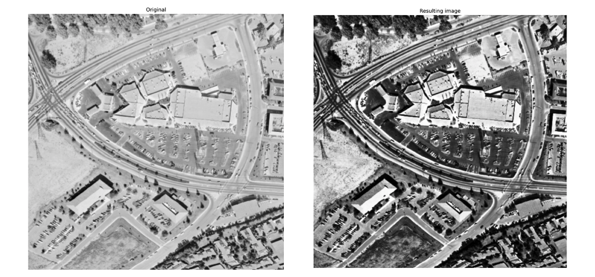

And here's the line of code for CLAHE: 

```python
# Import the necessary modules
from skimage import data, exposure

# Load the image
original_image = data.coffee()

# Apply the adaptive equalization on the original image
adapthist_eq_image = exposure.equalize_adapthist(original_image, clip_limit=0.03)

# Compare the original image to the equalized
show_image(original_image)
show_image(adapthist_eq_image, '#ImageProcessingDatacamp')
```

We can see the result here: 

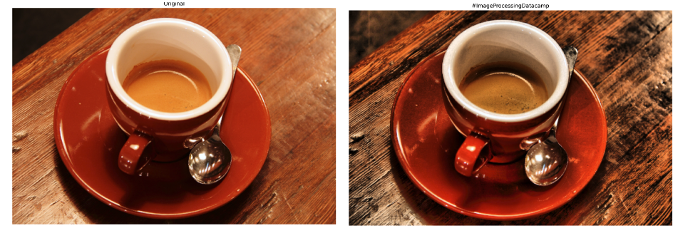

### Transformation

Transformation is used to prepare images for ML models. It is also used to optmize image sizes or rotating images. 

```python
from skimage.transform import rotate

# Rotate image in clockwise direction
image_rotated = rotate(image, -90)

# Rescaling images
from skimage.transform import rescale
# Rescale to downgrade. Make it 1/4 the origina.
image_rescaled = rescale(image, 1/4, anti_aliasing=True, multichannel=True)

# Resizing an image: 
from skimage.transform import resize
height, width = 400, 500
image_resized = resize(image, (height, width), anti_aliasing=True)
```

Here's an example of resizing the image with(left) and without anti aliasing (right): 

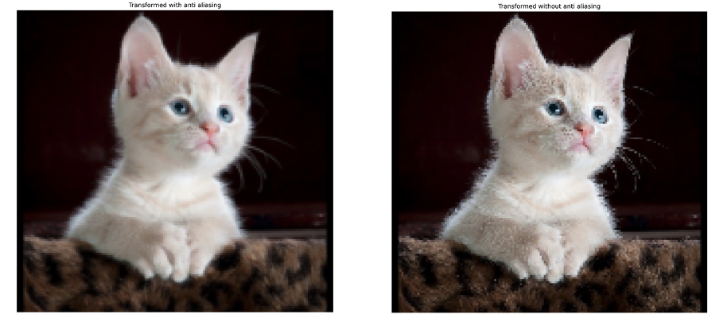

### Morphology

Spotting an object in a given image can be done by looking at its shape. This is what morphology does. Binary images, as we have seen can be distorted by noise or texture. **Morphological filtering** removes these imperfections by accouting for the form and structure of the objects in the image. These operations are suited for binary images but also work with grayscale. 

The basic morphological operations are **dilation** and **erosion** as the examples show below: 

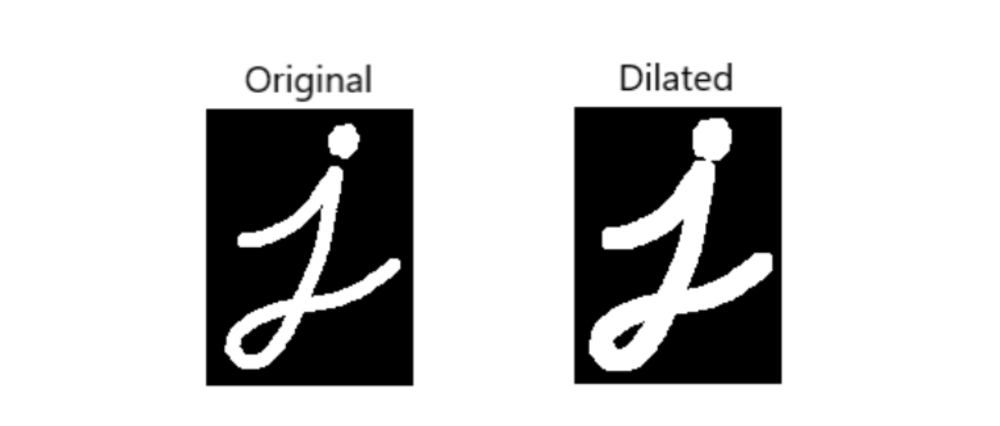

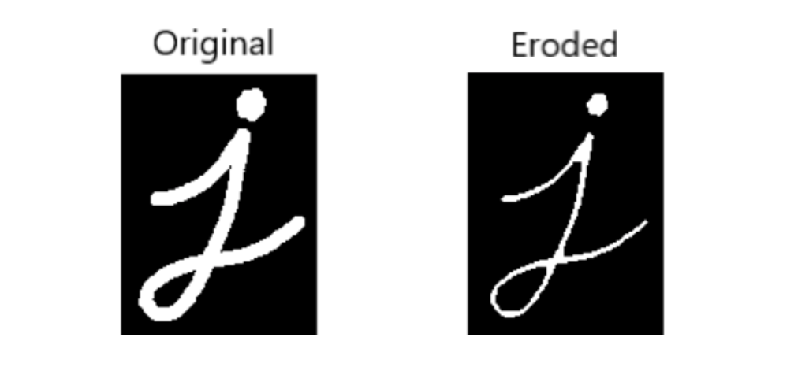

Dilation adds pixels adds pixels at the boundaries while erosion removes pixels at the boundaries. The number of pixels added or removed from the objects in an image depends on the size and shape of a structuring element used to process the image. 

A structuring element is a small binary image used to probe the input image. Here's an example of a structuring element, which is a 2x2 square. Depending on where the structuring element intersects with the image, morphological filtering is performed. For example, the intersection happens at A and B but not at C. 

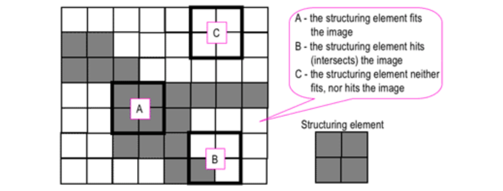

A structuring element can have different shapes. Each structuring element is defined by 1s in them. Here are some structuring elements: 

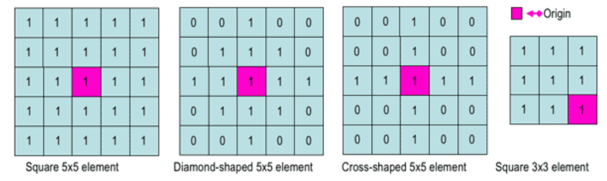

>   The structuring element should be a shape similar to the object we want to select. 

The pink cell is the center or the origin of the structuring element. We can create a structuring element in the following way: 

```python
from skimage import morphology

# Create a square: 
square = morphology.square(4)

# Create a rectangle
rectangle = morphology.rectangle(4, 2)
```

To apply erosion we do the following: 

```python
from skimage import morphology

struc_elem = rectangle(12,6)

eroded_image = morphology.binary_erosion(image_horse, selem=struc_elem)
```

To apply dilation, we do the following: 

```python
from skimage import morphology

dilated_image = morphology.binary_dilation(image_horse)
```

>   The structuring element in the morphology functions is optional

