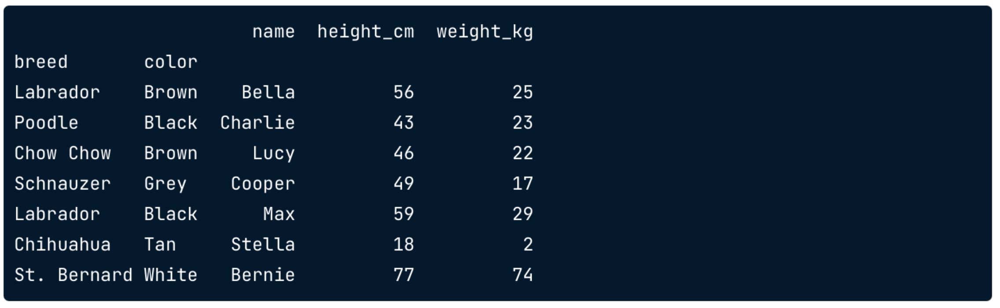
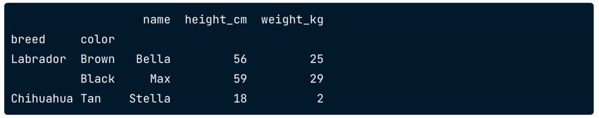
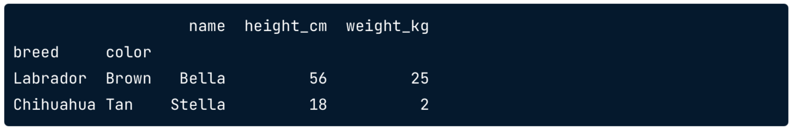
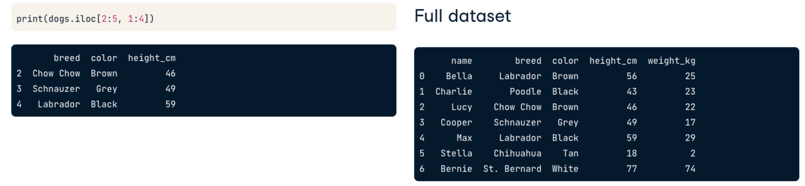
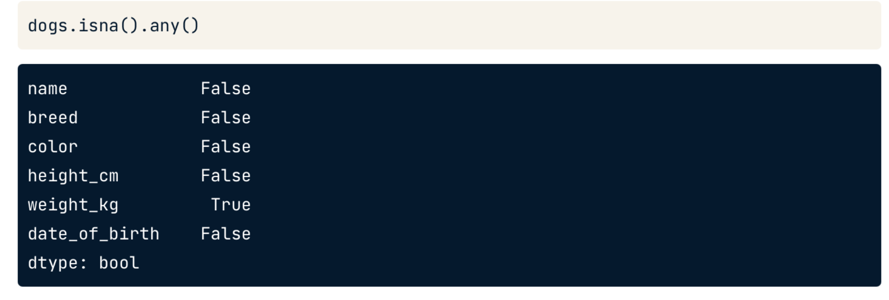
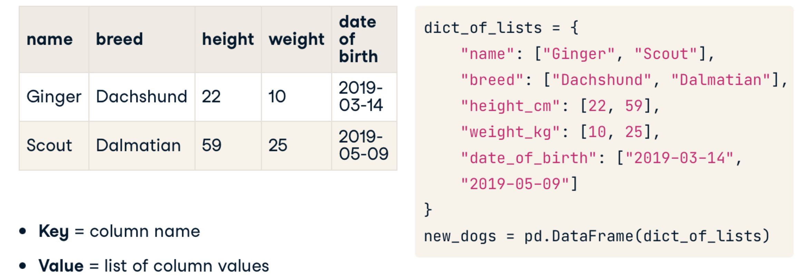

[TOC]


# pandas

This is my comprehensive notes on pandas. 

## Transforming Data

In this chapter we will learn the basics of pandas including sorting rows, subsetting, and adding new columns. 

pandas is designed to rectangular data such as this: 


Each column is a **feature** while each row is an **observation**. In pandas, such a table is represented by a **data frame**. Columns can contain various data types. 

### Basic Exploratory Commands

pandas has various methods to explore a data frame. These include: 

*   `.head()` - to view the first five observations in a data frame. Adding a number in the parenthesis will return that many observations. By default, it is 5. 
*   `.info()` - displays the names of the columns, the data types of these columns, the number of non-null columns, and how much memory the data frame takes.
*   `.shape` - shows the total number of rows and columns of a data frame. As this is an attribute, we write it without the parenthesis.
*   `.describe()` - computes descriptive statistics of the numerical columns such as mean, median and so on. 
*   `.values` - returns a list of values (if you do it on a given column) or returns a list of lists if done on a data frame.
*   `.columns` - returns an index of column names
*   `.index` - returns the row numbers or row names 

### Sorting

The data frame in pandas can be sorted using the `.sort_values()` command. This method takes the name of the column that is to be sorted as its argument. For example, if we have a data frame with column `color`, we would do the following:

```python
df.sort_values('color')
```

By default the `.sort_values()` sorted the column by ascending order. By setting `ascending=False`, we can sort the column in descending order: 

```python
df.sort_values('color', ascending=False)
```

We can **sort a data frame by multiple columns** by passing a list of column names: 

```python
df.sort_values(['color', 'weight'], ascending=[True, False])
```

Here we sort two columns, the first in ascending order and the second in a descending order. 

### Subsetting

We can subset a data frame by using the square brackets. For example, if we wish to look at one column, we can do the following: 

```python
df['color']
```

 This will give just the values of the column `color`.  

To select multiple columns, we need a list: 

```python
df[['color', 'weight']]
```

We can subset the data based on logical condition. For example, 

```python
df[df['weight'] > 100]
```

This will return the data frame with observations for which the weight is greater than 100. The inner command, `df['weight'] > 100` , creates a mask of boolean values. The outer command then simply outputs the observations for which the condition is `True`. 

We can also subset data based on text: 

```python
df[df['color'] == 'pink']
```

We can s**ubset the data using multiple conditions** using the `&` or the `|` operators. The first operator subsets the data when condition A **and** B are true while the second operator subsets the condition when either A **or** B are true. 

```python
df[ (df["color"] == 'pink') & (df['weight'] < 50)]
```

Note the use of parenthesis to separate the conditions. 

When you wish to **subset on categorical variables**, the easiest is to use the `.isin()` operator: 

```python
df[df['color'].isin(['pink', 'red'])]
```

This will result in observations for which the color is either pink OR red. 

### Adding a New Column

Adding a new column can be done in several ways. Let's first look at creating a new column based on an existing column. Suppose we have a column `distance` in miles. We wish to convert that into kilometers. Here's how we can do this: 

```python
df.loc[:, 'distance_km'] = df.loc[:, 'distance'] * 1.64
```


## Aggregating Data

In this section, you’ll calculate summary statistics on DataFrame columns, and master grouped summary statistics and pivot tables.

### Summarize Numerical Variables

The **summary statistics** that we can use on a given data frame are all methods: 

*   `.mean()`, `.median()`, `.mode()`
*   `.min()`, `.max()`
*   `.var()`, `.std()`
*   `.sum()`, `.quantile()`

We can also create custom summary statistics using the `.agg()` method: 

```python
def pct30(column):
    return column.quantile(0.3)

df['weights'].agg(pct30)
```

Here the `.agg()` column takes the name of the custom-defined function and computes the 30th percentile. 

We can use `.agg()` on multiple columns by simply passing a list: 

```python
df[['weights', 'heights']].agg(pct30)
```

We could also pass a list of functions in `.agg()` to apply multiple columns: 

```python
df[['weights', 'heights']].agg([min, max])
```

If you want to use `mean` or other descriptive statistics functions inside the `agg()` function, make use of numpy such as, 

```python
df[['weights', 'heights']].agg([np.mean, np.median])
```

**Cumulative statistics** can also be done on a given column using the `.cumsum()` as follows: 

```python
df['weights'].cumsum()
```

The other cumulative functions pandas has are the following: 

*   `.cummax()`
*   `.cummin()`
*   `.cumprod()`

### Summarize Categorical Variables

So far we have seen how to summarize variables that are numerical. Now we will see how we can summarize categorical variables. 

Suppose we have a dataset with multiple entries, we can remove all the duplicates using the `.drop_duplicates()` method. For example, we can identify duplicates using the `'name'` column: 

```python
df.drop_duplicates(subset='name')
```

Sometimes, we may need to use multiple columns to identify duplicates. We can pass the list of column names as the `subset`:

```python
df.drop_duplicates(subset=['name', 'breed'])
```

Once we have dropped the duplicates, we can **count the categorical variables** using the `.value_counts()` method as follows: 

```python
df['breed'].value_counts(sort=True)
```

This will return the counts associated with the column `breed` and sorted in the descending order. We can use the `normalize=True` to return the proportion of the total: 

```python
df['breed'].value_counts(normalize=True)
```

### Grouped Summary Statistics 

We can compute the summary statistics of groups. This is done using the `.groupby()`. This is exactly how it is done in SQL. 

```python
df.groupby('color')['weights'].mean()
```

Here we group the dataset by `color` and compute the mean of the `weights` for each color. 

Instead of passing just one summary statistic, we can pass multiple functions using `.agg()`: 

```python
df.groupby('color')['weights'].agg([min, max, sum])
```

 We can also do the same using multiple columns: 

```python
df.groupby(['color', 'breed'])['weights'].agg([min, max, sum])
```

So, here we group the data by `color` and `breed` and then compute the `min`, `max`, and `sum` of weights. 

### Pivot Tables

Pivot tables are something we have seen in Excel. Here's how the code differs: 

```python
# Simple Groupby: 
df.groupby('color')['weights'].mean()

# Using Pivot
df.pivot_table(values='weight', index='color')
```

Both commands will result in the same output.  The `pivot_table` uses the mean by default. 

If we wish to use a different aggregation function, we do the following: 

```python
df.pivot_table(values='weight', index='color', aggfunc=np.median)
```

We can pass multiple summary statistic values as a list: 

```python
df.pivot_table(values='weight', index='color', aggfunc=[np.median, np.mean])
```

If we wish to groupby multiple columns, we use the `columns` argument: 

```python
df.pivot_table(values='weight', index='color', columns='breed', fill_value=0
               aggfunc=[np.median, np.mean])
```

>   The difference between `groupby `and `pivot_table` is that what we groupby is called `index` in `pivot_table` and what we apply the aggregation function to is called `values`.  For additional columns we use the variable `columns`

We add the `fill_value=0` because without it, we will have `NaN` where there is no data. 

We can add the `margins=True` flag to compute the mean values down and across the table. 

```python
df.pivot_table(values='weight', index='color', columns='breed',
              fill_value=0, margins=True)
```


## Slicing & Indexing

The index is used to identify the observations or the rows in a data frame while the columns are used to identify the column names or features. 

### Setting an Index

An index can be set using the `.set_index()` method: 

```python
df_new = df.set_index('name')
```

We can undo the setting of the index using the `.reset_index()` method: 

```python
df_new.reset_index(drop=True)
```

This will reset the index and what the initial index was is then dropped. If this were not used, the index then becomes a column in the data frame. 

Indexing makes thing easier for subsetting. Let's consider the following code: 

```python
dogs[dogs['name'].isin(['Bella', 'Stella'])]
```

This is a bit more complicated than if we set the `name` as an index in the data frame and indexed that frame: 

```python
dogs.loc[["Bella", "Stella"]]
```

>   Values in the index don't need to be unique

### Setting Multiple Indexes

We can set multiple indexes by passing a list of column names as index: 

```python
dogs2 = dogs.set_index(['breed', 'color'])
```

This is known as multi-level indexes. This creates a data frame such as this: 



We see two index columns for a given data frame. 

To access the outer index, we pass a list: 

```python
dogs2.loc[['Labrador', 'Chihuahua']]
```



To access the inner index, we pass a tuple: 

```python
dogs2.loc[[('Labrador', 'Brown'), ('Chihuahua', 'Tan')]]
```



### Sorting an Index

We can sort a data frame by its index: 

```python
dogs2.sort_index()
```

The default is in ascending order. Just like sorting columns, we can pass a list of index columns to sort and the level: 

```python
dogs2.sort_index(level=['color', 'breed'], ascending=[True, False])
```

>   Indexes can be more complicated and goes against "tidy data" philosophy. So, use indexes and manipulation when required

## Slicing

Slicing and subsetting is done using the `.loc` and `.iloc` attributes. 

### Slicing by Indexes

In case of multiple indexes, **the slicing of the outer index level** is done in the following way: 

```python
dogs2.loc['Chow Chow': 'Poodle']
```

Note that the unlike slicing of lists, the last value of the sliced is included. So, here we see that `Poodle` will be included. 

When slicing the inner index level, we pass the tuple: 

```python
dogs2.loc[('Labrador', 'Brown'):('Schnauzer', 'Grey')]
```

### Slicing by Columns

We can also slice by column using the `.loc` attribute: 

```python
dogs2.loc[:, 'name':'height']
```

where `name` and `height` are two column names. 

### Slicing Using Dates

Slicing using dates is much easier if the date column is set as an index. Once this is done, we can simply choose the date range: 

```python
dogs.loc['2014-01-03':'2016-09-28']
```

The great thing with dates is that we can pass partial dates too to get what we want: 

```python
dogs.loc['2014':'2016']
```

This will return all records from 2014 to 2016. 

## Slicing by Row of Column Number

We can slice a data frame using a row or column number using the `.iloc` attribute

```python
dogs.iloc[2:5, 1:4]
```

This will return rows from 2 to 4 and columns from 1 to 3. 



## Subsetting Pivot Tables

Subsetting pivot tables can easily be done using the `loc` and `iloc` attributes. This is because the pivot tables create single or multiple indexes. Thus we can easily use the methods we have learned to slice a multi-index data frame. 

The use of calculating descriptive statistics in pivot tables is slightly different. For example, if we wish to compute the mean **across rows**, we would do the following: 

```python
my_pivot_table.mean(axis='index')
```

While computing the mean **across columns**, we would do the following: 

```python
my_pivot_table.mean(axis='columns')
```

## Looking for Missing Values

pandas allows you to look for missing values. This can be done in the following way: 

```python
df.isna().any()
```

will return all the columns and a boolean associated with it to tell you if any of the columns have missing values. 



We can also count the total number of missing values by columns by using `.isna().sum()`

Here are ways to address missing values: 

*   Drop them using the `.dropna()`
*   Fill the values with a constant value: `.fillna(<value>)`

## Creating DataFrames

Data frames in pandas can be created using **dictionaries**. We can either create from a list of dictionaries and dictionary of lists. 

### Dataframe from a List of Dictionaries

Here's an example of creating a dataframe from a list of dictionaries: 


### Dataframe from Dictionary of Lists




